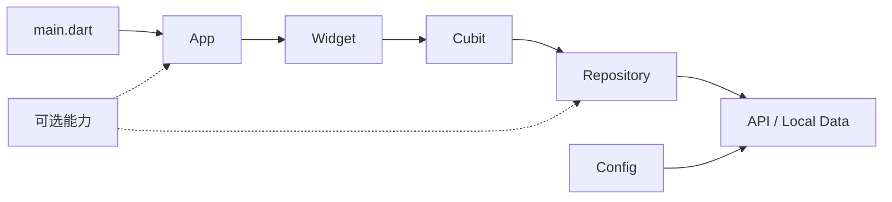

# 我拆开一套 Flutter 工程后，留下了五块真正需要的骨架

## 前言

最近我完整翻了一遍一套已经跑在 iOS 和 Android 上的 Flutter 工程。我想确认一件很具体的事：下次做一个小应用时，哪些结构值得一开始就搭好，哪些能力应该等产品真的需要再接入。这篇记录写给准备快速启动 Flutter 项目，又希望工程能自然长大的开发者。

<!-- 图片提示词
ALT: 小黑把庞大的 Flutter 工程拆成基础骨架与可选插件
PROMPT:
Generate one standalone 16:9 horizontal Chinese article illustration.

Visual DNA:
Pure white background. Minimalist black hand-drawn line art. Slightly wobbly pen lines. Lots of empty white space. Sparse Gundam-inspired red/blue/yellow handwritten Chinese annotations. Clean absurd product-sketch feeling. No gradients, no shadows, no paper texture, no complex background, no commercial vector style, no PPT infographic look, no cute mascot poster, no children's illustration, no realistic UI.

Recurring IP character required:
小黑, a small solid-black absurd creature with white dot eyes, tiny thin legs, blank serious expression, slightly uneven hand-drawn body shape. 小黑 must perform the core conceptual action, not decorate the scene. Make 小黑 serious, deadpan, and slightly bizarre, not cute.

Theme:
从成熟 Flutter 工程提炼小项目初始化骨架

Core idea:
小项目先搭五块稳定骨架，高阶能力按需要插入，工程保持轻量并留有扩展位置。

Composition:
画面中央的小黑蹲在一个打开的巨大工具箱前，把里面密集的模块分成两组。左侧地面放着五块稳固积木，沿黄色路径依次标注入口、路由、状态、数据、配置。右侧挂着几枚可拆卸插件，分别代表登录、推送、国际化、监控。小黑正把一枚插件放回架子，只留下五块积木组成一个小应用框架。

Suggested elements:
巨大工具箱 / 五块基础积木 / 可拆卸插件架 / 黄色初始化路径

Chinese handwritten labels:
应用入口 / 路由 / 状态 / 数据 / 配置 / 按需接入

Color use:
Black for main line art and 小黑. White for clean background and empty space. Yellow for main flow/path/arrows and attention anchors. Red only for key warnings/problems/results. Blue only for secondary notes or feedback/system state. Gray only for weak structure or inactive modules.

Constraints:
One image explains only one core structure. Keep the main subject around 40%-60% of the canvas. Preserve at least 35% blank white space. Use at most 5-8 short handwritten Chinese labels. Do not write a title in the top-left corner. Do not write the structure type on the image. Do not make it a formal diagram, course slide, or dense explainer. Do not copy prior examples or reuse known case compositions; invent a fresh visual metaphor for this specific article. It should be clear but not instructional, interesting but not childish, strange but clean.
-->

## 这件事的来由

Flutter 新项目很容易从两端失控。一端只有 `main.dart` 和一个页面，第二个功能进来就开始到处传状态；另一端一开始就塞入登录、推送、数据库、国际化、埋点和异常监控，业务还没出现，初始化代码已经铺满整个工程。

我顺着真实工程的启动、路由、状态、网络、缓存和测试链路逐段看下来。成熟项目里最稳定的部分其实很少，高阶服务都有明确的产品前提。这个观察直接改变了我对模板工程的要求：模板只负责建立稳定边界，具体服务由项目选项决定。

## 保留下来的五块骨架

我把通用基础层收敛成五块：

- Composition Root：集中创建依赖并启动应用。
- Router：统一页面入口和跳转规则。
- Cubit：承接页面意图与状态变化。
- Repository：隐藏远端、本地和模拟数据的来源差异。
- Config：管理环境变量和外部地址。

主题、HTTP 客户端和测试基线跟随这五块一起生成。国际化、登录、推送、本地数据库、分析、结构化日志和 Sentry 都以显式选项加入。基础项目因此可以直接运行，高阶模块也拥有固定落点。

## 我是怎么收敛的

第一步看启动入口。一个清楚的 `main.dart` 只做初始化和依赖组装，具体业务交给 App 与 Feature。第二步追踪用户操作，稳定链路始终是 `Widget → Cubit → Repository → Data Source`。第三步检查横切服务，登录依赖账号体系，推送依赖平台配置，监控依赖发布阶段，它们适合独立启用。

初始化过程直接使用 Flutter CLI。先调用本机 `flutter create` 生成当前 SDK 对应的平台工程，再补充通用目录、依赖和测试。这样可以继续跟随 Flutter 官方模板演进，同时保持每次生成的应用结构一致。

## 这个小项目骨架长什么样



目录按 feature 组织，公共基础设施放进 `core`：

```text
lib/
├── app/
├── core/config/
├── core/network/
├── core/theme/
├── features/home/
└── main.dart
```

当某个能力出现真实需求时，再加入对应目录和依赖。例如账号体系加入 `features/auth`，结构化离线数据加入 `core/database`，推送接入平台服务后加入 `core/push`。

## 这次最关键的判断

好的模板提供稳定的扩展位置，同时保持默认产物足够小。基础层解决代码往哪里放、状态怎么流、依赖在哪里创建。可选层解决某一类产品问题。两层分开以后，小工具可以保持十几个文件，正式产品也能沿同一条路径继续生长。

这个边界还能减少隐性配置。模板不会预埋真实 API、密钥、品牌名和业务模型。所有外部地址通过 Dart Define 进入，第三方服务启用后再完成各自的控制台配置。

## 技术细节和复现线索

基础工程先由 Flutter CLI 创建：

```sh
flutter create \
  --platforms ios,android \
  --org dev.example \
  /path/to/pocket_timer
```

进入项目后添加基础依赖：

```sh
flutter pub add flutter_bloc go_router dio
```

需要国际化、登录、存储或 Sentry 时，再按已确认的产品需求增加对应依赖和目录。完成骨架后执行 `dart format .`、`flutter analyze` 和 `flutter test`。推送、分析平台和登录供应商仍需要项目自己的账号、应用标识与后端协议，基础工程只创建安全的通用边界和接入说明。

下一次启动 Flutter 小项目时，我会先用基础模式跑通首页，再逐项启用已确认的产品能力。这个顺序让第一天的工程足够轻，也让后续扩展保持可预测。
