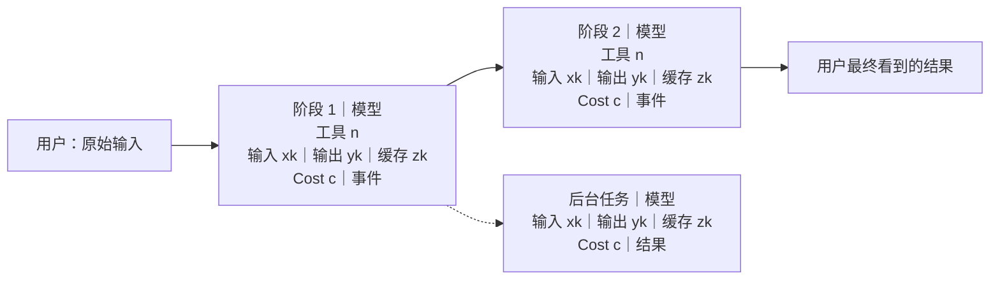

# Diagnosis Report Template

Use this exact structure for every user-facing diagnosis. Replace every placeholder with case-specific content. Do not rename, merge, reorder, or omit any numbered section. When evidence is unavailable, keep the section and state the gap explicitly. Stop after section 7. Do not repeat the same evidence in multiple sections unless it is necessary to understand the first failure.

Always remove private identities, signed URL secrets, credentials, access/API tokens, cookies, local usernames or paths, raw request identifiers, and Sentry event identifiers. User and assistant conversation text may appear verbatim only when the user explicitly requests it and only after this cleanup. Never expose system prompts, hidden reasoning or thinking, or unrelated session history.

## 置顶：置信度与优先级

Write one compact line before the numbered report:

`Confidence high / medium / low｜日志复现：是 / 否 / 部分｜Sentry 复现：是 / 否 / 未确认 / 未查询｜Sentry 检索：完整 / 部分 / 未查询｜优先级 P0 / P1 / P2 [具体用户影响]`

- `日志复现` means the attached runtime logs directly preserve the reported failure transition, not merely a nearby error.
- `Sentry 复现` means a case-matched Sentry event independently preserves the same user operation and failure. A generic or merely simultaneous event is not a reproduction.
- When runtime logs contain no explicit error block, use `Sentry 复现：未查询｜Sentry 检索：未查询` and state `no-explicit-log-error` in the relevant evidence explanation.
- If `retrievalComplete=false` but a case-matched event exists, use `Sentry 复现：是｜Sentry 检索：部分`.
- If `retrievalComplete=false` and no case-matched event was retrieved, use `Sentry 复现：未确认｜Sentry 检索：部分`; partial retrieval cannot prove absence.
- Use `Sentry 复现：否` only when retrieval completed and the retrieved evidence contains no case-matched event.
- Put only the blocked user outcome inside the priority brackets. Keep confidence and priority independent.

## 1. 一句话结论

In two or three sentences, state what the user encountered, the first evidence-backed technical failure, and the practical impact. Confidence and priority already appear above; do not repeat them here. Do not lead with an internal exception name that the user cannot place in context.

## 2. 建议标题

Provide exactly one proposed GitHub Issue title in a single line.

- Preserve the user-visible symptom.
- Add the narrowest confirmed product or technical boundary only when it improves triage.
- Exclude unconfirmed causes, private identifiers, implementation proposals, and priority labels.
- If the existing title is already optimal, explicitly recommend retaining it and repeat the exact title.
- This is a suggestion only. Do not update Issue metadata without separate approval.

## 3. 用户故事：如果我是这个用户

Write a short first-person account using only observed facts:

> 我在 `[场景]` 做了 `[操作]`。我原本预期 `[预期]`，但实际看到 `[现象]`。这让我无法 `[实际影响]`。

If intent or impact is unknown, say so instead of completing the story speculatively.

## 4. 用户说法与系统事实的桥

| 用户说/看到的 | 系统里对应发生的事 | 关系 | 证据 |
|---|---|---|---|
| `[用户原话或忠实转述]` | `[产品事件、状态变化或错误]` | `直接对应 / 下游表现 / 尚未证实` | `[来源与时间]` |

This table explains how the user's language maps to the implementation. Never treat the user's causal guess as a technical fact.
Keep only the rows needed to connect the reported symptom to the first failure; normally no more than three.

## 5. 用户操作与消耗时间轴

Normalize time zones before comparing events. Include one compact Mermaid diagram that follows the user's operation through the first divergence and final outcome. This is an operation and usage timeline, not a generic “normal versus actual” architecture diagram.



- Keep the diagram scan-friendly. Group adjacent model calls only when they belong to the same user-visible phase; do not hide a retry, model change, background task, charge boundary, or first failure inside an aggregate.
- Put background or extracted subtasks to the right of the main path and name them by what they did, not by an internal implementation label.
- Every phase with available usage must show the resolved model, tool count, input Token, output Token, cache Token, `Cost`, and the important event. Use `k` units for Token values.
- `Cost` is the runtime usage field, not Credits or plan balance. If it is absent, write `Cost —`; never convert it to Credits without cloud-ledger evidence.
- For credit, quota, or unexpectedly expensive-turn reports, usage and Cost are mandatory in the diagram. For other reports, show them whenever the attachment contains them.
- Begin one state transition before the first charge or failure when the previous session/model/cache state explains the outcome.
- Show a model change separately from its initiator. Without a selection/settings event, do not say the user switched models.

## 6. 真实对话与详细时间线

Put the complete detailed timeline inside a default-collapsed disclosure block so the main report stays compact:

```html
<details>
<summary>展开查看真实对话与详细时间线</summary>

[timeline content]

</details>
```

Inside the disclosure block:

- Use list items rather than a table. Each phase should connect its time range, relevant user message, user-visible Agent reply or action, resolved model, tool count, input/output/cache Token, Cost, and event.
- Select phases because they match the reported operation through time, correlation, or behavior. Recency alone is not relevance.
- Include every phase needed to reconcile the usage story even when this exceeds six items; remove unrelated events first.
- `消耗 Token` includes repeated context and cache processing; it is not the amount of unique new text.
- Keep action descriptions short and user-facing. Do not list raw tool names, arguments, or internal call mechanics.
- Faithfully paraphrase user messages by default. When the user explicitly requests the original conversation, quote the relevant original user messages and user-visible assistant replies with runtime role/time labels after mandatory secret cleanup.
- Do not invent an Agent reply for a tool-call-only step. Describe that step as an action; quote assistant text only when the runtime record contains a user-visible assistant message.

## 7. 故障层与代码逻辑

- `用户可见层：` `[symptom]`
- `产品/子系统层：` `[failure surface]`
- `第一处技术失败：` `[code or data-flow boundary]`
- `后续连锁反应：` `[downstream effects]`
- `关联代码：` `[current file/function or linked change]`
- `结论边界：` `[narrowest proven explanation and the important unknowns]`

Explain why the user's wording and the code path describe the same event. Keep the first failure separate from later cascades.
